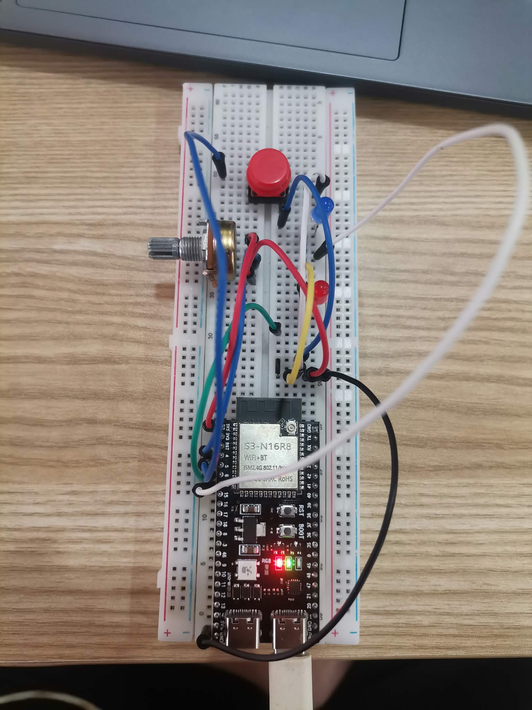
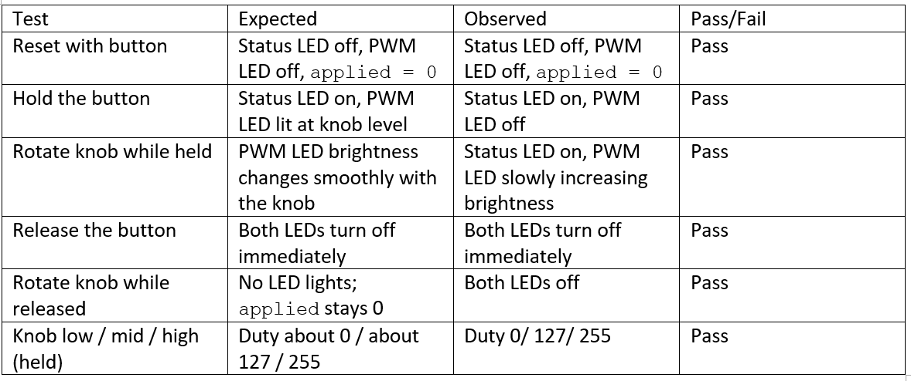

# ESP32-S3 Button-Enabled Brightness Control

Hold a button to enable an LED, then use a potentiometer to control its brightness. Releasing the button turns everything off.

## Components
- ESP32-S3 dev board
- 1 push button
- 1 potentiometer (10 kΩ)
- 2 LEDs + 2 × 220 Ω resistors
- Breadboard and jumper wires

## Inputs and Outputs
| Part | Pin | Type |
|---|---|---|
| Button | GPIO 5 | Input (internal pull-up) |
| Potentiometer wiper | GPIO 4 | Analog input (ADC1) |
| Status LED | GPIO 6 | Digital output |
| PWM LED | GPIO 7 | PWM output |

## Wiring

## How the Code Works
**Constants:** The four pin numbers are declared as const, so they cannot change while the program is running. Using names also makes the code easier to understand and change.

**Boolean state:** The bool variables store true or false. buttonPressed checks if the button is pressed, while pwmReady checks if the PWM is working. Both are used to decide if the LED can turn on.

**Numeric readings:** rawInput gets the potentiometer value from 0 to 4095. scaleToDuty() changes it to a PWM value from 0 to 255 called requestedDuty. appliedDuty is the value sent to the LED. The LED only uses the value when the button is pressed.

The program is split into `readInputs()`, `processInputs()`, and `updateOutputs()`. The scaling is done by `scaleToDuty(int raw)`.

## Test Results

### Low / Middle / High knob positions
| Position | Raw | Duty | LED |
|---|---|---|---|
| Low | 1033 | 64 | Dem |
| Middle | 3028 | 188 | Medium |
| High | 4095 | 255 | Bright |

## Demonstration
[Watch the demo](demo.mp4)

## How to Run
1. Install ESP32 core 3.x in Arduino IDE.
2. Select board **ESP32S3 Dev Module**.
3. Open `sketch/sketch.ino`, upload, and open Serial Monitor at 115200 baud.
